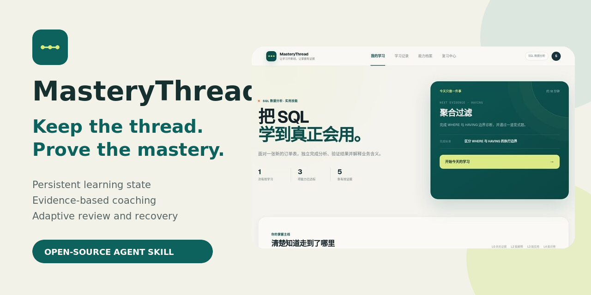
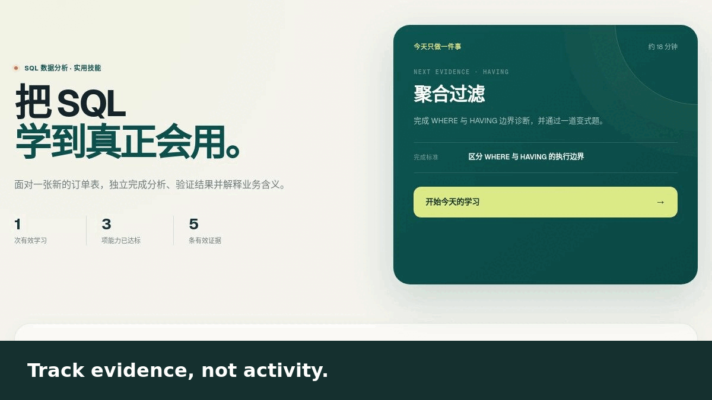

# MasteryThread

<p align="center">
  
</p>

<h3 align="center">Keep the thread. Prove the mastery.</h3>

<p align="center">
  Most learning tools track what you consumed. MasteryThread tracks what you can prove.
</p>

<p align="center">
  <a href="https://mastery-thread.heyard2025.chatgpt.site">Product preview</a>
  ·
  <a href="packages/mastery-thread-skill.zip">Download the Skill</a>
  ·
  <a href="README.zh-CN.md">简体中文</a>
</p>



> **Public demo:** the hosted preview is open to everyone—no sign-in required. The Skill and local workspace are also open source and can be used independently.

## Why MasteryThread

AI tutors are good at explaining. They are much less reliable at answering three questions:

- What can the learner actually do without help?
- Did a successful answer come from mastery or from a strong hint?
- After an interruption, where should the learner resume?

MasteryThread treats learning as a persistent evidence system. It asks the learner to perform first, applies the smallest useful intervention, verifies again with a changed task, and records only the level supported by observable evidence.

## See the workflow



```text
Retrieve → Observe → Intervene → Verify → Record → Schedule
```

The Skill makes the coaching decisions. The local workspace keeps the portable learning state, evidence ledger, weaknesses, and review queue visible.

## What makes it different

| Typical learning tracker | MasteryThread |
|---|---|
| Counts lessons, streaks, or time | Records observable performance evidence |
| Treats a correct answer as mastery | Discounts answers produced with strong hints |
| Resumes from the last page | Resumes from the last verified capability |
| Stores progress inside one chat | Uses a portable, versioned `learning-state.json` |
| Schedules generic repetition | Prioritizes overdue prerequisites and open weaknesses |

## Three ways to use it

### 1. Prepare for an exam or interview

Turn a syllabus or role description into a dependency-aware route. Diagnose the real baseline, verify recall and application separately, and schedule reviews from observed performance.

### 2. Build a practical skill

Learn SQL, user interviewing, data analysis, writing, or another applied skill through authentic tasks. A unit reaches L3 only when the learner can complete a representative task independently.

### 3. Resume a long learning project

Import the previous `learning-state.json`. MasteryThread restores the last confirmed capability, unresolved weakness, due reviews, and exact next action instead of reconstructing the project from chat history.

## Quick start

### Option A — install from the packaged Skill

1. Download [`mastery-thread-skill.zip`](packages/mastery-thread-skill.zip).
2. Attach it in ChatGPT or Codex and ask: `Install this Skill.`
3. Start with:

```text
Use MasteryThread to help me build a learning project for conducting
independent user interviews. Diagnose my real baseline before making the plan.
```

### Option B — install from source in Codex

```bash
git clone https://github.com/heyard2026/mastery-thread.git
mkdir -p ~/.codex/skills
cp -R mastery-thread/skill/mastery-thread ~/.codex/skills/mastery-thread
```

### Option C — run the local workspace

Requires Node.js 22.13 or later.

```bash
git clone https://github.com/heyard2026/mastery-thread.git
cd mastery-thread/web-app
npm ci
npm run dev -- --host 0.0.0.0
```

Learning data stays in the current browser by default. Import and export use the same canonical `learning-state.json` handled by the Skill.

## Mastery levels

| Level | Meaning | Minimum acceptable evidence |
|---|---|---|
| L0 | No evidence yet | No usable performance |
| L1 | Recall | Retrieve facts, steps, or syntax without a critical hint |
| L2 | Explain | Explain relationships and boundaries in the learner's own words |
| L3 | Apply | Complete and verify a representative task independently |
| L4 | Transfer | Adapt, justify, and handle exceptions in a materially different context |

`worked-step` or `solution` hints cannot independently support L3 or L4. Time spent, confidence, and lesson completion are context—not proof of competence.

## Repository structure

```text
mastery-thread/
├── skill/mastery-thread/        # Coaching logic, evidence rules, state scripts
├── web-app/                     # Device-local learning workspace
├── media/                       # Product and launch visuals
└── packages/                    # Downloadable Skill package
```

The SQL flow in the frontend is an explicit deterministic demonstration. It does not pretend to be cloud model coaching. Domain-specific diagnosis, task generation, source grounding, and mastery decisions belong to the Skill.

## Validate the project

```bash
cd skill/mastery-thread
python3 scripts/test_mastery_thread.py

cd ../../web-app
npm run lint
npm run build
```

## Privacy and state integrity

- No account is required for the local workspace.
- Imported learning files are not sent to third-party services by the frontend.
- State uses semantic versions and preserves unknown fields during updates.
- The system stores concise performance, error, and verification summaries—not hidden chain-of-thought.

## Independent design

MasteryThread was designed from first principles around persistent learning state and verifiable mastery. Its state contract, mastery rubric, diagnostic loop, visual language, and frontend interactions are original work. It is not a fork, reskin, or code copy of another learning Skill.

## Current boundaries

- General-domain adaptive diagnosis runs through the MasteryThread Skill.
- The frontend is device-local and does not yet provide cloud sync or collaboration.
- The hosted product preview is public and requires no sign-in; the source and local workspace can also be used independently.

## Contributing

Early feedback is especially valuable around mastery decisions, interruption recovery, schema portability, and real learning workflows. Open an issue with the learning goal, what happened, and what you expected.

## License

MIT
